# Library Management System

A plain Java, in-memory Library Management System designed using Object-Oriented Programming principles, SOLID principles, Java Collections, and common design patterns.

## Overview

This project manages books, patrons, borrowing and returning of books, library branches, reservations, notifications, and book recommendations.

The application uses an in-memory data model and does not require a database or external API.

## Features

### Core Features

- Add, update, remove, and search books
- Search books by:
  - ISBN
  - Title
  - Author
- Add, update, and remove patrons
- Track patron borrowing history
- Checkout books
- Return books
- Track book availability
- Custom exception handling
- Application logging using `java.util.logging`

### Optional Features

#### Multi-Branch Support

- Create multiple library branches
- Add books to branches
- Transfer books between branches

#### Reservation System

- Reserve books that are currently borrowed
- Prevent duplicate reservations by the same patron
- Maintain reservations in FIFO order
- Cancel reservations
- Notify the next patron when a reserved book becomes available

#### Recommendation System

Supports multiple recommendation strategies:

- Author-based recommendations
- Recently published book recommendations

## Project Architecture

The project follows a layered architecture:

```text
                 Main
                  |
                  v
              Services
                  |
          +-------+-------+
          |               |
          v               v
     Repositories     Strategies
          |
          v
    In-Memory Storage


Notifications:

ReservationService
        |
        v
NotificationService
        |
        v
NotificationFactory
        |
        v
NotificationObserver
     /      |       \
    v       v        v
  Email     SMS    Console
```

The main responsibilities are separated across different layers:

- **Entity layer** represents domain objects.
- **Repository layer** manages in-memory data.
- **Service layer** contains business logic.
- **Observer layer** handles notification behavior.
- **Factory layer** creates notification observers.
- **Strategy layer** provides different recommendation algorithms.

## Package Structure

```text
com.airtribe.library
│
├── entity
│   ├── Book
│   ├── LibraryBranch
│   ├── Loan
│   ├── Patron
│   └── Reservation
│
├── enums
│   ├── BookStatus
│   └── NotificationType
│
├── exception
│   ├── BookNotFoundException
│   ├── BookUnavailableException
│   ├── InvalidLoanException
│   └── PatronNotFoundException
│
├── factory
│   └── NotificationFactory
│
├── observer
│   ├── NotificationObserver
│   ├── EmailNotificationObserver
│   ├── SmsNotificationObserver
│   └── ConsoleNotificationObserver
│
├── repository
│   ├── BookRepository
│   ├── InMemoryBookRepository
│   ├── PatronRepository
│   ├── InMemoryPatronRepository
│   ├── BranchRepository
│   ├── InMemoryBranchRepository
│   ├── ReservationRepository
│   └── InMemoryReservationRepository
│
├── service
│   ├── BookService
│   ├── PatronService
│   ├── LendingService
│   ├── BranchService
│   ├── ReservationService
│   ├── NotificationService
│   └── RecommendationService
│
├── strategy
│   ├── RecommendationStrategy
│   ├── AuthorRecommendationStrategy
│   └── RecentPublicationRecommendationStrategy
│
├── util
│   └── LoggerUtil
│
├── Main
└── LibraryTest
```

## Object-Oriented Programming

### Encapsulation

Entity fields are private and accessed through controlled methods.

For example, `Book` manages its availability status through:

```java
markAsBorrowed();
markAsAvailable();
```

This prevents external classes from directly modifying the book's internal status.

### Abstraction

Interfaces define contracts without exposing implementation details.

Examples include:

- `BookRepository`
- `PatronRepository`
- `BranchRepository`
- `ReservationRepository`
- `NotificationObserver`
- `RecommendationStrategy`

### Inheritance

Custom exceptions extend `RuntimeException`.

For example:

```java
public class BookNotFoundException extends RuntimeException {
}
```

This allows application-specific exceptions while reusing Java's exception hierarchy.

### Polymorphism

Different notification implementations can be handled through the common `NotificationObserver` interface.

```text
NotificationObserver
        |
        +-- EmailNotificationObserver
        +-- SmsNotificationObserver
        +-- ConsoleNotificationObserver
```

The recommendation system also uses polymorphism:

```text
RecommendationStrategy
        |
        +-- AuthorRecommendationStrategy
        +-- RecentPublicationRecommendationStrategy
```

## SOLID Principles

### Single Responsibility Principle

Each service has a focused responsibility:

- `BookService` → book management
- `PatronService` → patron management
- `LendingService` → checkout and return operations
- `BranchService` → branch management and book transfers
- `ReservationService` → reservation management
- `NotificationService` → notification management
- `RecommendationService` → book recommendations

### Open/Closed Principle

The system can be extended without modifying existing core logic.

For example, a new notification type can be added by creating another implementation of `NotificationObserver`.

Similarly, a new recommendation algorithm can be added by implementing `RecommendationStrategy`.

### Liskov Substitution Principle

Concrete implementations can be used wherever their abstraction is expected.

For example:

```java
NotificationObserver observer =
        new EmailNotificationObserver(patron);
```

The concrete observer can be used wherever a `NotificationObserver` is required.

### Interface Segregation Principle

The application uses focused interfaces instead of one large interface.

For example, book operations are defined in `BookRepository`, while reservation operations are defined separately in `ReservationRepository`.

### Dependency Inversion Principle

Services depend on repository abstractions rather than concrete repository implementations.

For example:

```java
private final BookRepository bookRepository;
```

instead of:

```java
private final InMemoryBookRepository bookRepository;
```

This makes the application easier to change and test.

## Design Patterns

### 1. Observer Pattern

The Observer pattern is used for reservation availability notifications.

`NotificationObserver` defines the common notification contract.

Concrete observers include:

- `EmailNotificationObserver`
- `SmsNotificationObserver`
- `ConsoleNotificationObserver`

`NotificationService` maintains the observers and notifies them when a reserved book becomes available.

```text
NotificationService
        |
        v
NotificationObserver
    /       |       \
   v        v        v
 Email      SMS    Console
```

### 2. Factory Pattern

`NotificationFactory` is responsible for creating the appropriate notification observer based on `NotificationType`.

Supported notification types are:

```text
EMAIL
SMS
CONSOLE
```

This avoids tightly coupling the service layer to individual concrete observer classes.

Example:

```java
NotificationObserver observer =
        NotificationFactory.createObserver(
                NotificationType.EMAIL,
                patron
        );
```

### 3. Strategy Pattern

The recommendation system uses the Strategy pattern.

`RecommendationStrategy` defines the recommendation contract.

The available strategies are:

- `AuthorRecommendationStrategy`
- `RecentPublicationRecommendationStrategy`

The strategy can be changed at runtime through `RecommendationService`.

```text
RecommendationService
        |
        v
RecommendationStrategy
       /       \
      v         v
  Author      Recent
```

## Java Collections

Different Java Collections are used according to the requirements of each operation.

### HashMap

`HashMap` is used by in-memory repositories for fast lookup using identifiers.

Examples:

```text
ISBN      → Book
Patron ID → Patron
Branch ID → LibraryBranch
```

### Set

`LibraryBranch` uses a `Set<Book>` to avoid duplicate book references within a branch.

### Queue

Reservations use a `Queue` to maintain FIFO order.

For example:

```text
P001 → P002 → P003
  ^
  |
First reservation
```

When a book becomes available, the first reservation is processed first.

### List

Lists are used for:

- Patron borrowing history
- Search results
- Repository results
- Notification observers

## Exception Handling

The application uses custom runtime exceptions for business-level errors.

The custom exceptions include:

```text
BookNotFoundException
BookUnavailableException
PatronNotFoundException
InvalidLoanException
```

These exceptions make business errors explicit and easier to understand.

Examples of handled scenarios include:

- Book does not exist
- Patron does not exist
- Book is already borrowed
- Invalid return operation
- Invalid loan
- Duplicate book registration
- Duplicate reservation

## Logging

The project uses Java's built-in:

```text
java.util.logging
```

Logging is centralized through `LoggerUtil`.

Example output:

```text
[INFO] Book added successfully: 9780135166307
[INFO] Checkout requested. ISBN: 9780135166307, Patron: P001
[INFO] Book checked out successfully. ISBN: 9780135166307, Patron: P001
[INFO] Reservation notification sent. ISBN: 9780135166307, Patron: P002
```

Warnings are also logged for failed business operations such as attempting to checkout an unavailable book.

## How to Run

### Requirements

- JDK 21 or compatible Java version
- IntelliJ IDEA or another Java IDE

### Run the Application

Run:

```text
com.airtribe.library.Main
```

The main program demonstrates:

1. Adding books
2. Adding patrons
3. Searching books
4. Creating library branches
5. Adding books to branches
6. Transferring books between branches
7. Checking out books
8. Creating reservations
9. Returning books
10. Sending reservation notifications
11. Generating author-based recommendations
12. Generating recent-publication recommendations

## Testing

The project includes a lightweight test class:

```text
com.airtribe.library.LibraryTest
```

The test suite covers:

- Adding books
- Duplicate book validation
- Checkout
- Preventing checkout of borrowed books
- Returning books
- Creating reservations
- Duplicate reservation validation
- FIFO reservation behavior
- Branch transfers
- Author-based recommendations

Current test result:

```text
========== TEST RESULTS ==========
Passed: 10
Failed: 0
ALL TESTS PASSED
```

## Class Diagram

```mermaid
classDiagram

    class Book {
        -String isbn
        -String title
        -String author
        -int publicationYear
        -BookStatus status
        +markAsBorrowed()
        +markAsAvailable()
        +equals()
        +hashCode()
    }

    class Patron {
        -String patronId
        -String name
        -String email
        -String phoneNumber
        -List~Loan~ borrowingHistory
        +addLoan()
        +getBorrowingHistory()
    }

    class Loan {
        -Book book
        -Patron patron
        -LocalDate checkoutDate
        -LocalDate returnDate
        +markAsReturned()
    }

    class LibraryBranch {
        -String branchId
        -String name
        -String location
        -Set~Book~ books
        +addBook()
        +removeBook()
        +hasBook()
    }

    class Reservation {
        -Book book
        -Patron patron
        -LocalDateTime reservationDate
        -boolean notified
        +markAsNotified()
    }

    class BookRepository {
        <<interface>>
        +save()
        +delete()
        +findByIsbn()
        +findByTitle()
        +findByAuthor()
        +findAll()
    }

    class InMemoryBookRepository

    class PatronRepository {
        <<interface>>
    }

    class InMemoryPatronRepository

    class BranchRepository {
        <<interface>>
    }

    class InMemoryBranchRepository

    class ReservationRepository {
        <<interface>>
        +save()
        +findByBook()
        +findByPatron()
        +delete()
        +pollNextReservation()
    }

    class InMemoryReservationRepository

    class BookService
    class PatronService
    class LendingService
    class BranchService
    class ReservationService
    class NotificationService
    class RecommendationService

    class NotificationObserver {
        <<interface>>
        +update(Book)
    }

    class EmailNotificationObserver
    class SmsNotificationObserver
    class ConsoleNotificationObserver

    class NotificationFactory {
        +createObserver()
    }

    class RecommendationStrategy {
        <<interface>>
        +recommend()
    }

    class AuthorRecommendationStrategy
    class RecentPublicationRecommendationStrategy

    Book "1" --> "*" Loan
    Patron "1" --> "*" Loan
    Book "1" --> "*" Reservation
    Patron "1" --> "*" Reservation
    LibraryBranch "1" --> "*" Book

    BookRepository <|.. InMemoryBookRepository
    PatronRepository <|.. InMemoryPatronRepository
    BranchRepository <|.. InMemoryBranchRepository
    ReservationRepository <|.. InMemoryReservationRepository

    NotificationObserver <|.. EmailNotificationObserver
    NotificationObserver <|.. SmsNotificationObserver
    NotificationObserver <|.. ConsoleNotificationObserver

    RecommendationStrategy <|.. AuthorRecommendationStrategy
    RecommendationStrategy <|.. RecentPublicationRecommendationStrategy

    NotificationFactory --> NotificationObserver
    NotificationService --> NotificationObserver
    RecommendationService --> RecommendationStrategy

    BookService --> BookRepository
    PatronService --> PatronRepository
    ReservationService --> ReservationRepository
    LendingService --> BookService
    LendingService --> PatronService
    LendingService --> ReservationService
    BranchService --> BranchRepository
```



## Future Improvements

Possible future enhancements include:

- Persistent database storage
- User authentication and authorization
- Due dates and overdue fine calculation
- Multiple physical copies of the same ISBN
- REST API
- Web or mobile user interface
- Real email and SMS integrations
- More advanced recommendation algorithms